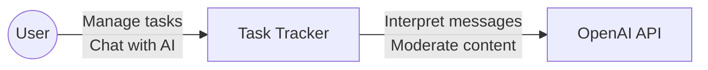
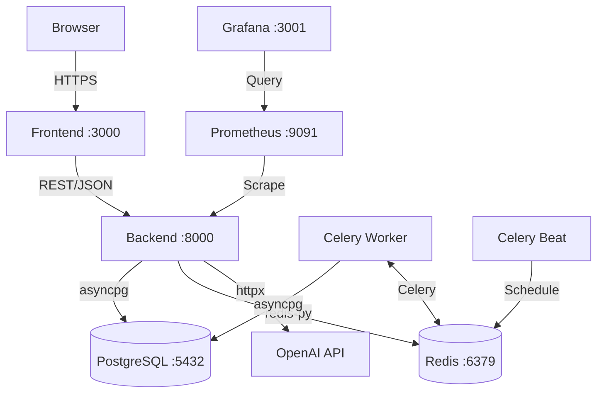
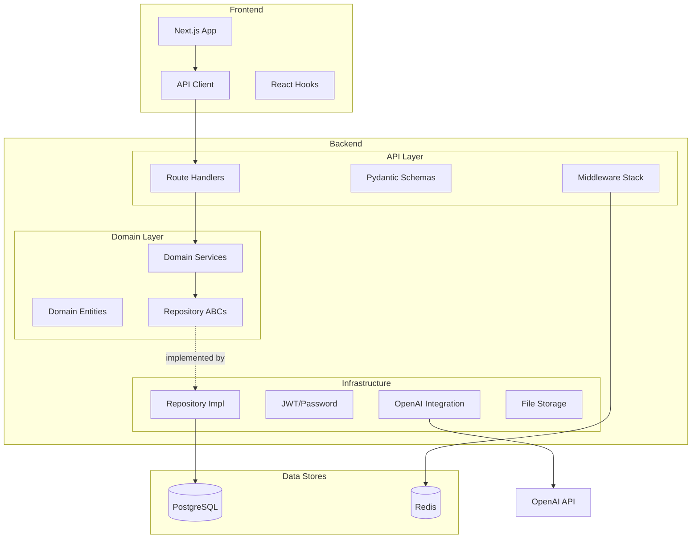
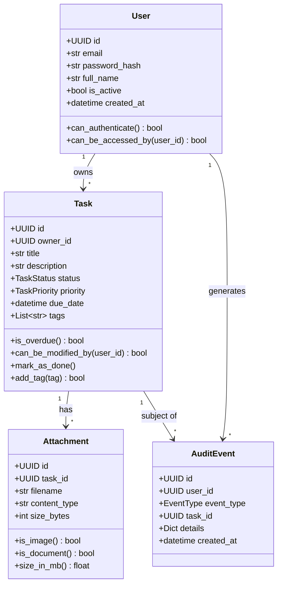
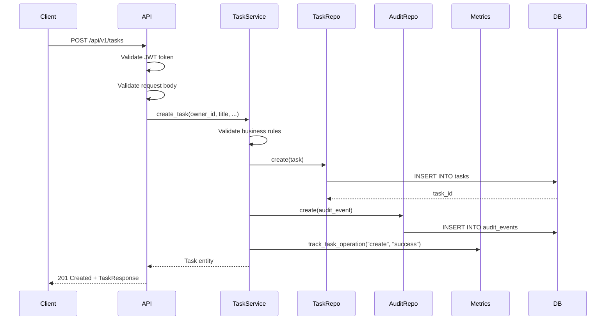
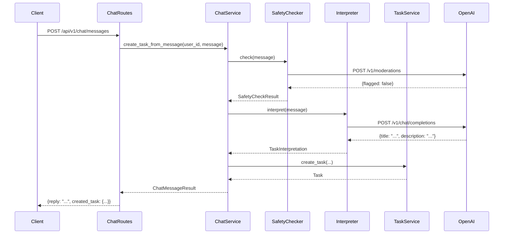
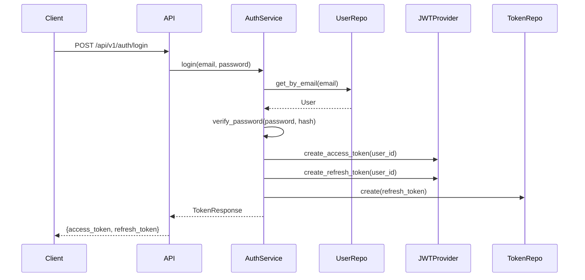
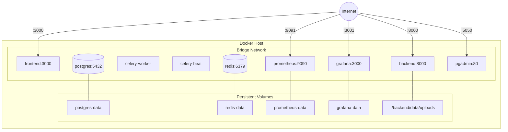

# Arc42 Architecture Documentation - Task Tracker

## 1. Introduction and Goals

### 1.1 Requirements Overview

Task Tracker is a production-ready task management platform with an AI-powered chat assistant that understands natural language commands.

**Core Requirements:**
- Users can create, read, update, and delete tasks
- Tasks have status, priority, due dates, and tags
- Users can attach files to tasks (drag-and-drop upload)
- AI assistant interprets natural language ("Remind me to...") into tasks
- Complete audit trail of all user actions
- JWT-based authentication with refresh tokens

**Quality Requirements:**
- **Performance**: Sub-second response times, rate limiting
- **Security**: Encrypted passwords, JWT tokens, content moderation
- **Reliability**: Fail-open design for external dependencies
- **Observability**: Metrics, structured logging, correlation IDs

### 1.2 Quality Goals

| Priority | Quality Goal | Scenario |
|----------|--------------|----------|
| 1 | **Security** | User credentials are never exposed; all auth uses JWT tokens |
| 2 | **Reliability** | System remains functional when OpenAI API is unavailable |
| 3 | **Maintainability** | New features can be added without modifying existing code |
| 4 | **Performance** | API responses complete within 200ms under normal load |
| 5 | **Observability** | Any issue can be traced via correlation IDs and audit logs |

### 1.3 Stakeholders

| Role | Expectations |
|------|--------------|
| **End Users** | Intuitive task management, reliable AI assistant |
| **Developers** | Clean architecture, easy to understand and extend |
| **Operations** | Easy deployment, comprehensive monitoring |
| **Security Team** | OWASP compliance, audit trails |

## 2. Architecture Constraints

### 2.1 Technical Constraints

| Constraint | Background |
|------------|------------|
| Python 3.11+ | Required for modern async features |
| PostgreSQL 16 | Primary data store, required for JSONB and advanced indexing |
| Redis 7 | Required for rate limiting and Celery message broker |
| Docker | Deployment containerization |

### 2.2 Organizational Constraints

| Constraint | Background |
|------------|------------|
| Open Source Stack | No proprietary database or middleware dependencies |
| OpenAI API Optional | System must work without AI features |
| Single-Tenant | Each deployment serves one organization |

### 2.3 Conventions

| Convention | Description |
|------------|-------------|
| Domain-Driven Design | Clear bounded contexts and ubiquitous language |
| Repository Pattern | Data access abstraction via interfaces |
| API Versioning | All endpoints prefixed with `/api/v1/` |
| ADR Documentation | Significant decisions documented as ADRs |

## 3. System Scope and Context

### 3.1 Business Context



| Partner | Input | Output |
|---------|-------|--------|
| **User** | Task operations, chat messages | Task lists, confirmations, AI responses |
| **OpenAI API** | Natural language messages | Structured task data, moderation flags |

### 3.2 Technical Context



## 4. Solution Strategy

### 4.1 Technology Decisions

| Decision | Rationale |
|----------|-----------|
| **FastAPI** | Modern async Python, automatic OpenAPI docs, Pydantic validation |
| **SQLAlchemy 2.0 Async** | Type-safe ORM with async support |
| **Pydantic** | Runtime validation, serialization, settings management |
| **Next.js** | React with SSR, TypeScript support, optimized builds |
| **Celery** | Mature distributed task queue with scheduling |
| **Redis** | Fast in-memory store for caching and message broker |

### 4.2 Architecture Approach

**Three-Layer Clean Architecture:**
```
┌─────────────────────────────────────────────────┐
│                   API Layer                     │
│  (Routes, Schemas, Middleware, Exception Handlers)  │
├─────────────────────────────────────────────────┤
│                 Domain Layer                    │
│  (Entities, Services, Repository Interfaces)   │
├─────────────────────────────────────────────────┤
│              Infrastructure Layer               │
│  (Repository Impl, Auth, Storage, LLM)         │
└─────────────────────────────────────────────────┘
```

**Key Patterns:**
- Repository Pattern for data access abstraction
- Dependency Injection via FastAPI's `Depends()`
- Rich Domain Models with behavior methods
- Fail-Open design for external integrations

## 5. Building Block View

### 5.1 Whitebox: Overall System



### 5.2 Level 2: Domain Services

| Service | Responsibility | Dependencies |
|---------|----------------|--------------|
| **TaskService** | Task CRUD, validation, status transitions | TaskRepository, AuditRepository, TagService, MetricsProvider |
| **AuthService** | Registration, login, token refresh, password change | UserRepository, RefreshTokenRepository, JWTProvider, PasswordHasher |
| **ChatService** | Natural language interpretation, safety checking | TaskService, TaskInterpreter, SafetyChecker |
| **AttachmentService** | File upload, download, validation | AttachmentRepository, StorageProvider, AuditRepository |
| **ReminderService** | Due-soon task reminder processing | TaskRepository, ReminderLogRepository |
| **TagService** | Tag normalization, deduplication | TagRepository |

### 5.3 Level 2: Domain Entities



## 6. Runtime View

### 6.1 Task Creation Flow



### 6.2 Chat Task Creation Flow



### 6.3 Authentication Flow



## 7. Deployment View

### 7.1 Docker Compose Deployment



### 7.2 Container Configuration

| Container | Image | Resources | Health Check |
|-----------|-------|-----------|--------------|
| postgres | postgres:16-alpine | - | pg_isready |
| redis | redis:7-alpine | - | redis-cli ping |
| backend | custom (Dockerfile) | - | curl /api/v1/health |
| celery-worker | custom (Dockerfile) | - | - |
| celery-beat | custom (Dockerfile) | - | - |
| frontend | custom (Dockerfile) | - | - |
| prometheus | prom/prometheus:v2.54.1 | - | - |
| grafana | grafana/grafana:11.4.0 | - | - |

## 8. Cross-cutting Concepts

### 8.1 Domain Model Concepts

**Rich vs Anemic Domain Models:**
- Entities contain behavior methods (`task.mark_as_done()`)
- Business rules enforced in entity methods
- Services orchestrate entity interactions

**Entity Conversion:**
```
SQLAlchemy Model (DB) ←→ Pydantic Entity (Domain)
```
- Repositories handle conversion via `_to_entity()` methods
- Domain layer never sees ORM models

### 8.2 Security Concepts

| Concept | Implementation |
|---------|----------------|
| **Password Hashing** | bcrypt with salt |
| **Token Authentication** | JWT (HS256) with type claim |
| **Access Tokens** | 15-minute expiry |
| **Refresh Tokens** | 7-day expiry, stored hashed, revocable |
| **Rate Limiting** | Redis sliding window, 100 req/min |
| **Content Moderation** | OpenAI Moderation API (optional) |
| **CORS** | Configured allowed origins |

### 8.3 Error Handling

**Domain Exception Hierarchy:**
```
DomainException (base)
├── ValidationError → 400 Bad Request
├── AuthenticationError → 401 Unauthorized
├── AuthorizationError → 403 Forbidden
├── NotFoundError → 404 Not Found
└── RateLimitExceeded → 429 Too Many Requests
```

**Global Exception Handler:**
- All domain exceptions mapped to HTTP status codes
- Correlation ID included in error responses
- Stack traces hidden in production

### 8.4 Observability

**Metrics (Prometheus):**
- HTTP request duration and count
- Task operation metrics (create, update, delete)
- Authentication metrics (login, refresh, failure)
- Audit event counts by type

**Logging (Structured JSON):**
- Correlation ID propagation
- Request/response logging middleware
- Service-level operation logging

**Audit Trail:**
- Immutable audit events stored in database
- JSONB details for flexible schema
- Survives entity deletion (SET NULL FK)

### 8.5 Fail-Open Design

External dependencies fail gracefully:
- **OpenAI unavailable**: Fall back to regex task interpretation
- **Redis unavailable**: Rate limiting disabled (allows all requests)
- **Safety check fails**: Skip moderation, allow request

## 9. Architecture Decisions

See [Architecture Decision Records](../adr/) for detailed decision documentation.

Key decisions:
1. [ADR-0001: Use Domain-Driven Design](../adr/0001-use-domain-driven-design.md)
2. [ADR-0002: Separate ORM and Domain Models](../adr/0002-separate-orm-and-domain-models.md)
3. [ADR-0003: JWT Authentication Strategy](../adr/0003-jwt-authentication-strategy.md)
4. [ADR-0004: Celery for Background Jobs](../adr/0004-celery-for-background-jobs.md)
5. [ADR-0005: Fail-Open LLM Integration](../adr/0005-fail-open-llm-integration.md)

## 10. Quality Requirements

### 10.1 Quality Tree

```
Quality
├── Security
│   ├── Authentication (JWT)
│   ├── Authorization (owner-based)
│   └── Input Validation (Pydantic)
├── Reliability
│   ├── Fail-Open External Dependencies
│   ├── Health Checks
│   └── Idempotent Operations
├── Performance
│   ├── Async I/O
│   ├── Connection Pooling
│   └── Rate Limiting
├── Maintainability
│   ├── Clean Architecture
│   ├── Type Safety
│   └── Comprehensive Tests
└── Observability
    ├── Metrics
    ├── Logging
    └── Audit Trail
```

### 10.2 Quality Scenarios

| ID | Quality | Scenario | Response |
|----|---------|----------|----------|
| Q1 | Security | User attempts SQL injection | Parameterized queries prevent attack |
| Q2 | Reliability | OpenAI API timeout | Regex interpreter handles request |
| Q3 | Performance | 100 concurrent users | All requests complete < 500ms |
| Q4 | Maintainability | Add new task field | Change entity, repo, schema, types |
| Q5 | Observability | Debug failed request | Trace via correlation ID in logs |

## 11. Risks and Technical Debt

### 11.1 Risks

| Risk | Probability | Impact | Mitigation |
|------|-------------|--------|------------|
| OpenAI API changes | Medium | Medium | Abstracted behind interface |
| Database growth | Medium | High | Implement archiving strategy |
| Single point of failure | Low | High | Horizontal scaling planned |

### 11.2 Technical Debt

| Item | Priority | Effort |
|------|----------|--------|
| Add integration tests with real DB | High | Medium |
| Implement caching layer | Medium | Medium |
| Add WebSocket for real-time updates | Low | High |
| Email notification integration | Low | Medium |

## 12. Glossary

| Term | Definition |
|------|------------|
| **Task** | A unit of work with title, status, priority, and optional due date |
| **Attachment** | A file uploaded and associated with a task |
| **Audit Event** | An immutable record of a user action |
| **Refresh Token** | Long-lived token used to obtain new access tokens |
| **Interpreter** | Component that extracts structured task data from natural language |
| **Repository** | Abstraction over data access operations |
| **Entity** | Domain object with identity and behavior |
| **Value Object** | Immutable object defined by its attributes (enums) |
