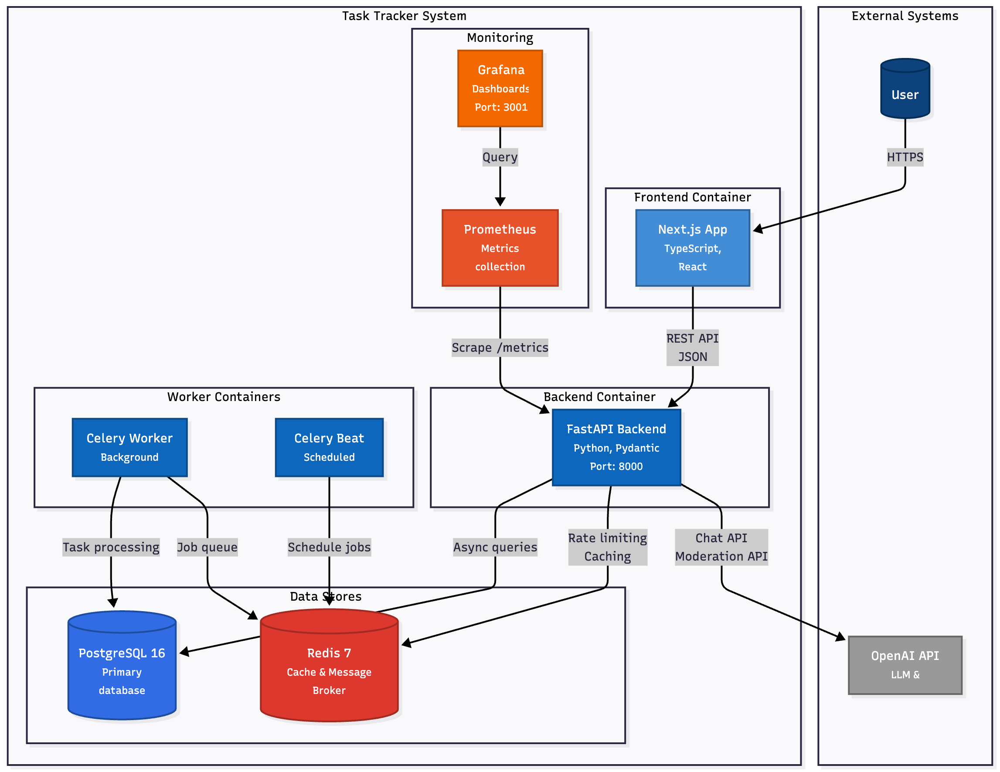
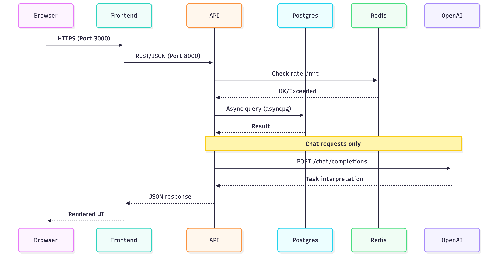

# C4 Model - Level 2: Container Diagram

The Container diagram shows the high-level shape of the software architecture and how responsibilities are distributed across containers.

## Container Diagram



## Container Descriptions

### Application Containers

| Container | Technology | Purpose | Port |
|-----------|------------|---------|------|
| **Frontend** | Next.js 14, TypeScript | Single-page application for user interaction | 3000 |
| **Backend API** | FastAPI, Python 3.11+ | REST API, business logic, authentication | 8000 |
| **Celery Worker** | Celery, Python | Process background jobs (reminders) | - |
| **Celery Beat** | Celery Beat | Schedule periodic tasks | - |

### Data Stores

| Container | Technology | Purpose | Port |
|-----------|------------|---------|------|
| **PostgreSQL** | PostgreSQL 16 Alpine | Primary relational database | 5432 |
| **Redis** | Redis 7 Alpine | Rate limiting, caching, message broker | 6379 |

### Monitoring

| Container | Technology | Purpose | Port |
|-----------|------------|---------|------|
| **Prometheus** | Prometheus v2.54.1 | Metrics collection and storage | 9091 |
| **Grafana** | Grafana 11.4.0 | Visualization and dashboards | 3001 |
| **pgAdmin** | pgAdmin 4 | Database administration UI | 5050 |

## Communication Protocols



## Docker Compose Services

```yaml
services:
  postgres:      # Primary database
  redis:         # Cache & message broker
  backend:       # FastAPI application
  celery-worker: # Background task processor
  celery-beat:   # Task scheduler
  frontend:      # Next.js application
  prometheus:    # Metrics collection
  grafana:       # Dashboards
  pgadmin:       # DB administration
```

## Volume Mounts

| Volume | Container | Purpose |
|--------|-----------|---------|
| `postgres-data` | PostgreSQL | Persistent database storage |
| `redis-data` | Redis | Persistent cache data |
| `prometheus-data` | Prometheus | Metrics time-series data |
| `grafana-data` | Grafana | Dashboard configurations |
| `./backend/data/uploads` | Backend | File attachment storage |

## Health Checks

| Container | Health Check | Interval |
|-----------|--------------|----------|
| PostgreSQL | `pg_isready -U tasktracker` | 10s |
| Redis | `redis-cli ping` | 10s |
| Backend | `GET /api/v1/health` | 30s |

## Network Architecture

All containers run on the default Docker bridge network, allowing inter-container communication via service names:

- Frontend → Backend: `http://backend:8000`
- Backend → PostgreSQL: `postgresql://postgres:5432`
- Backend → Redis: `redis://redis:6379`
- Prometheus → Backend: `http://backend:8000/metrics`
- Grafana → Prometheus: `http://prometheus:9090`

## Next Level

See [Component Diagram](component.md) for the internal structure of the Backend container.
