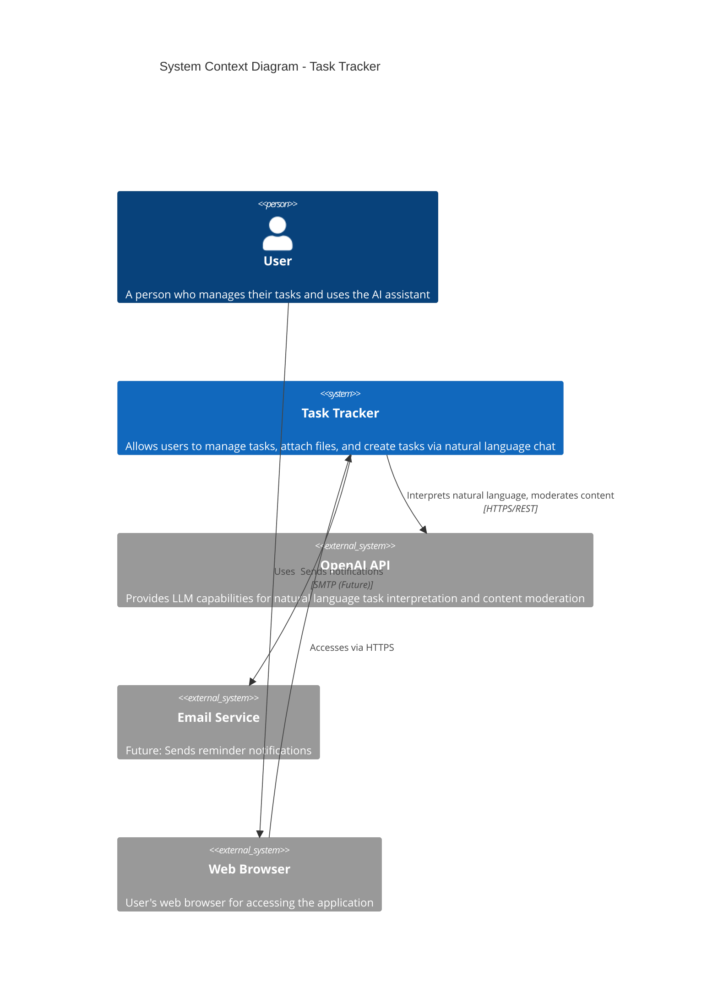
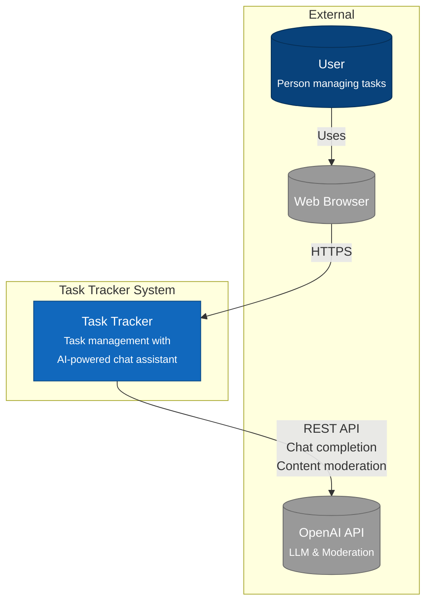

# C4 Model - Level 1: System Context Diagram

The System Context diagram shows Task Tracker and its relationships with users and external systems.

## System Context Diagram



## Alternative Rendering (Standard Mermaid)



## Context Description

### Primary Users

| Actor | Description | Interaction |
|-------|-------------|-------------|
| **User** | End user managing personal tasks | Accesses via web browser, creates tasks manually or via chat |

### External Systems

| System | Purpose | Protocol | Notes |
|--------|---------|----------|-------|
| **OpenAI API** | Natural language interpretation, content moderation | HTTPS/REST | Fail-open design - system works without it |
| **Web Browser** | User interface delivery | HTTPS | Modern browsers (Chrome, Firefox, Safari, Edge) |
| **Email Service** | Reminder notifications | SMTP | Future capability |

### System Capabilities

Task Tracker provides:

1. **Task Management** - CRUD operations with search, filtering, sorting, pagination
2. **File Attachments** - Upload, download, and manage files attached to tasks
3. **AI Chat Assistant** - Natural language task creation ("Remind me to...")
4. **Audit Logging** - Immutable record of all user actions
5. **Authentication** - JWT-based with refresh tokens
6. **Scheduled Reminders** - Background job processing for due-soon tasks

## Key Quality Attributes

| Attribute | Requirement |
|-----------|-------------|
| **Availability** | System remains functional if OpenAI is unavailable (fallback to regex) |
| **Security** | JWT authentication, bcrypt passwords, content moderation |
| **Performance** | Rate limiting (100 req/min), async everywhere |
| **Observability** | Prometheus metrics, audit logging, request correlation IDs |

## Data Flow Summary

```
User Request → Frontend → Backend API → Domain Services → Database
                                    ↓
                              [If chat] → OpenAI API (optional)
                                    ↓
                              Response ← Domain Entity ← Repository
```

## Next Level

See [Container Diagram](container.md) for the high-level technology architecture.
