# Data Flow Diagrams

This document describes how data flows through the Task Tracker system.

## 1. Overall Data Flow

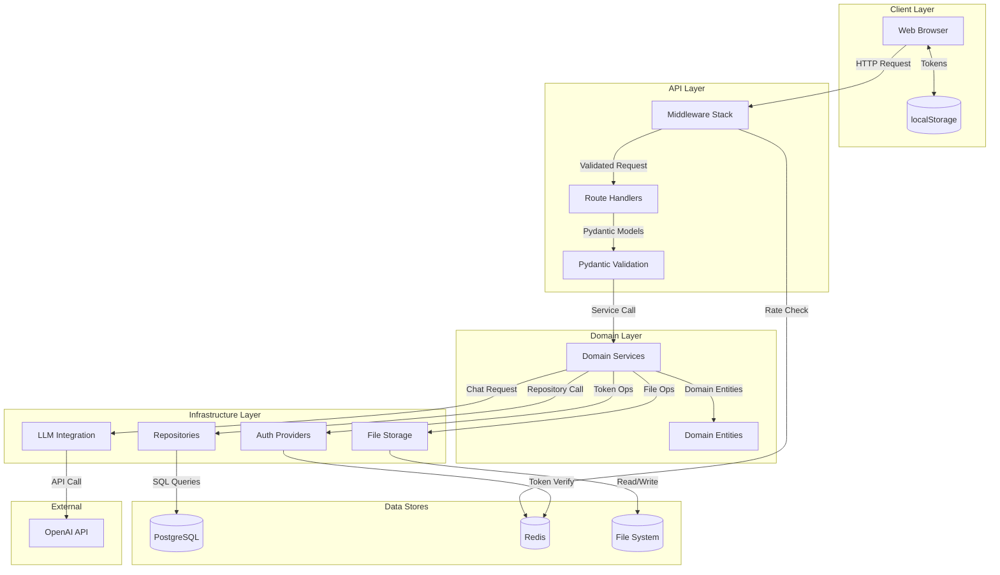

## 2. Request Processing Flow

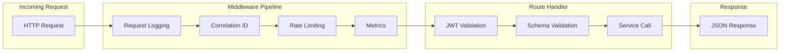

## 3. Task Data Flow

### 3.1 Task Creation

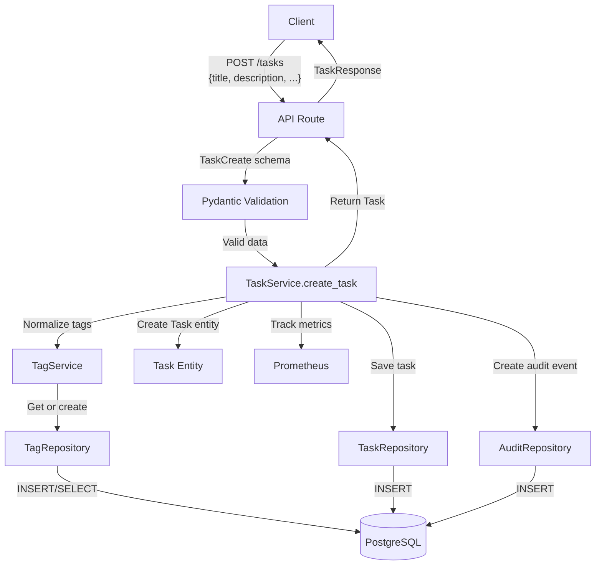

### 3.2 Task Query Flow

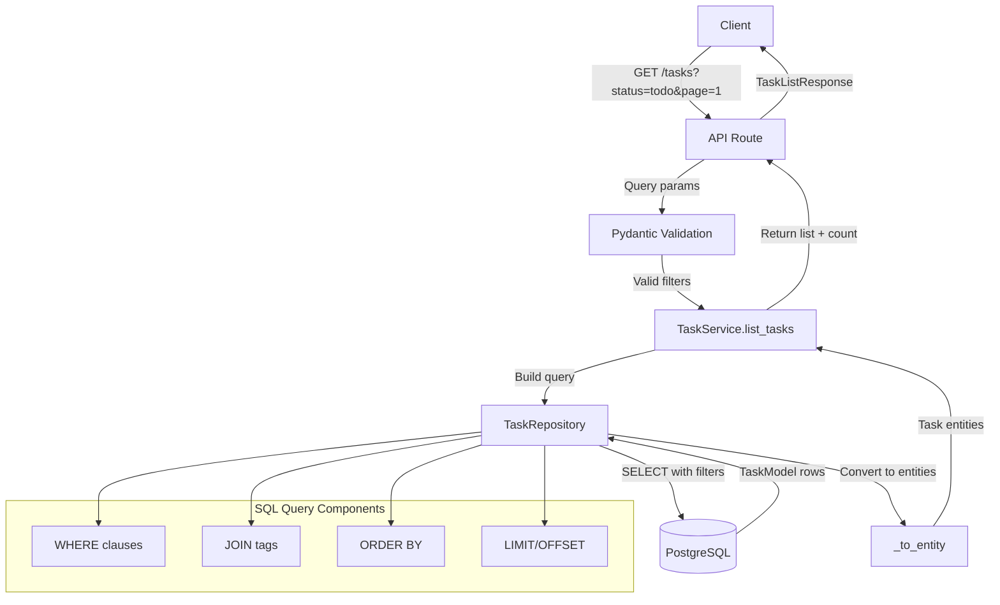

## 4. Authentication Data Flow

### 4.1 Login Flow

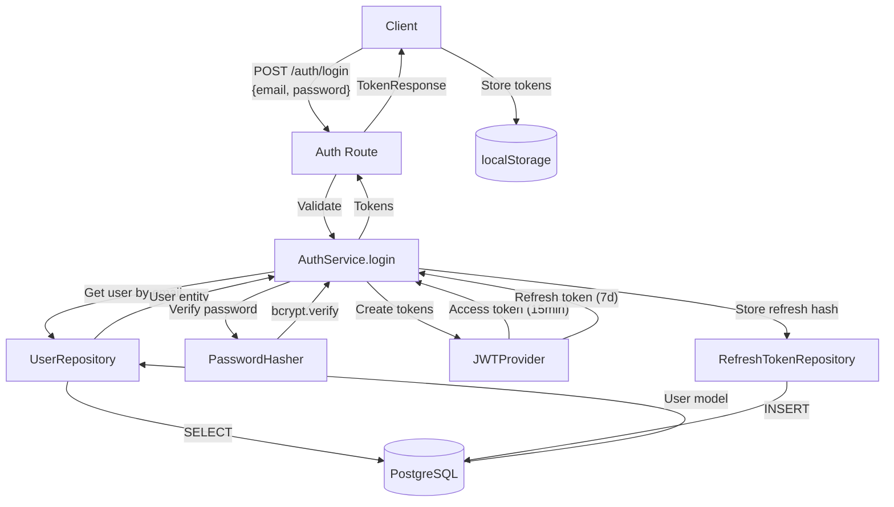

### 4.2 Token Refresh Flow

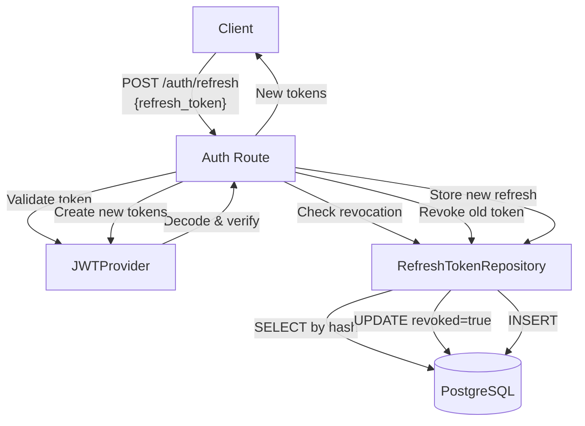

## 5. Chat/LLM Data Flow

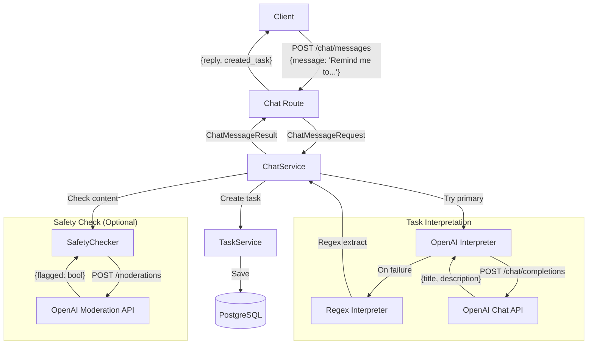

## 6. File Attachment Data Flow

### 6.1 Upload Flow

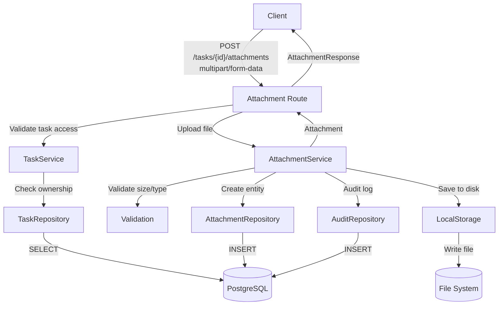

### 6.2 Download Flow

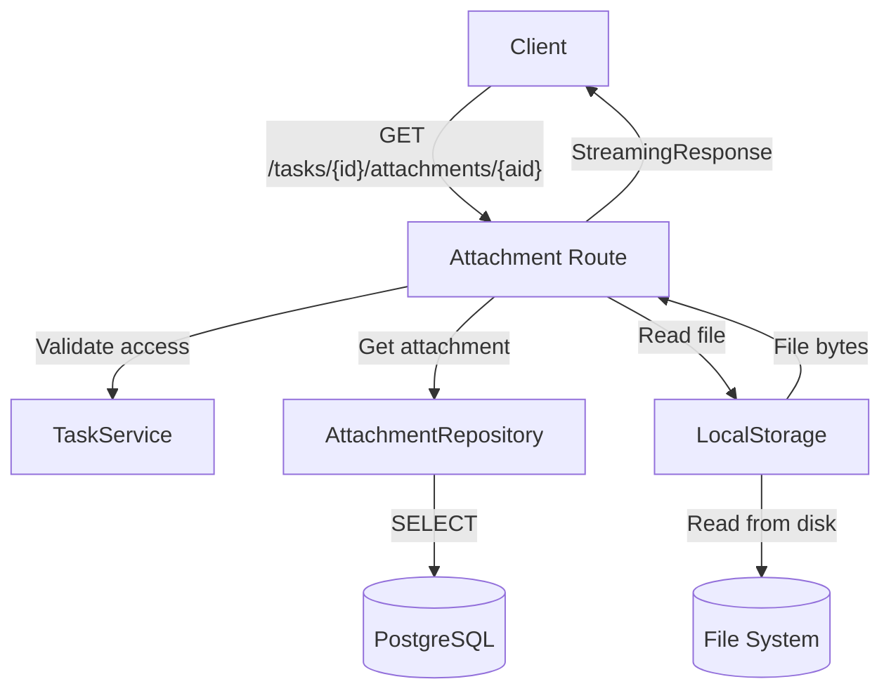

## 7. Background Job Data Flow

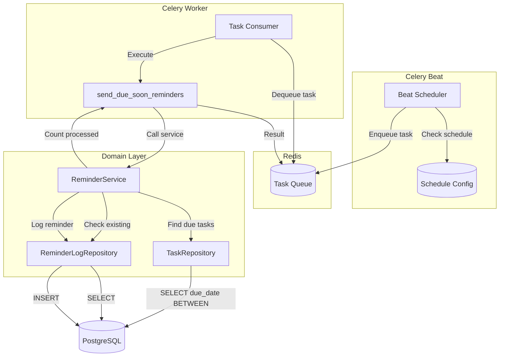

## 8. Metrics Data Flow

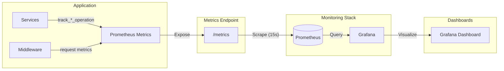

## Data Transformations Summary

| Layer | Input Format | Output Format | Transformation |
|-------|--------------|---------------|----------------|
| API → Domain | Pydantic Schema | Domain Entity | Schema validation |
| Domain → Infra | Domain Entity | ORM Model | Entity to model |
| Infra → Database | ORM Model | SQL | SQLAlchemy serialization |
| Database → Infra | SQL Result | ORM Model | SQLAlchemy deserialization |
| Infra → Domain | ORM Model | Domain Entity | `_to_entity()` |
| Domain → API | Domain Entity | Response Schema | `model_validate()` |
