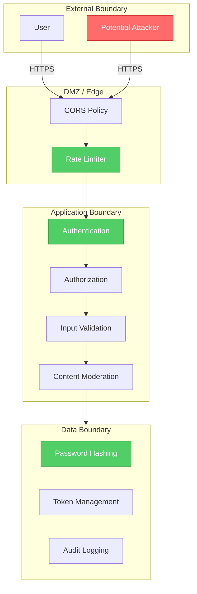
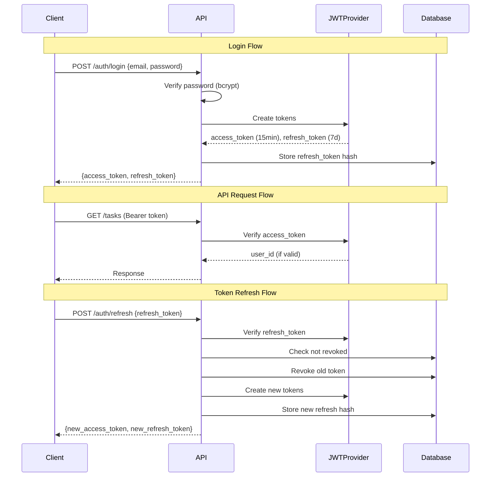
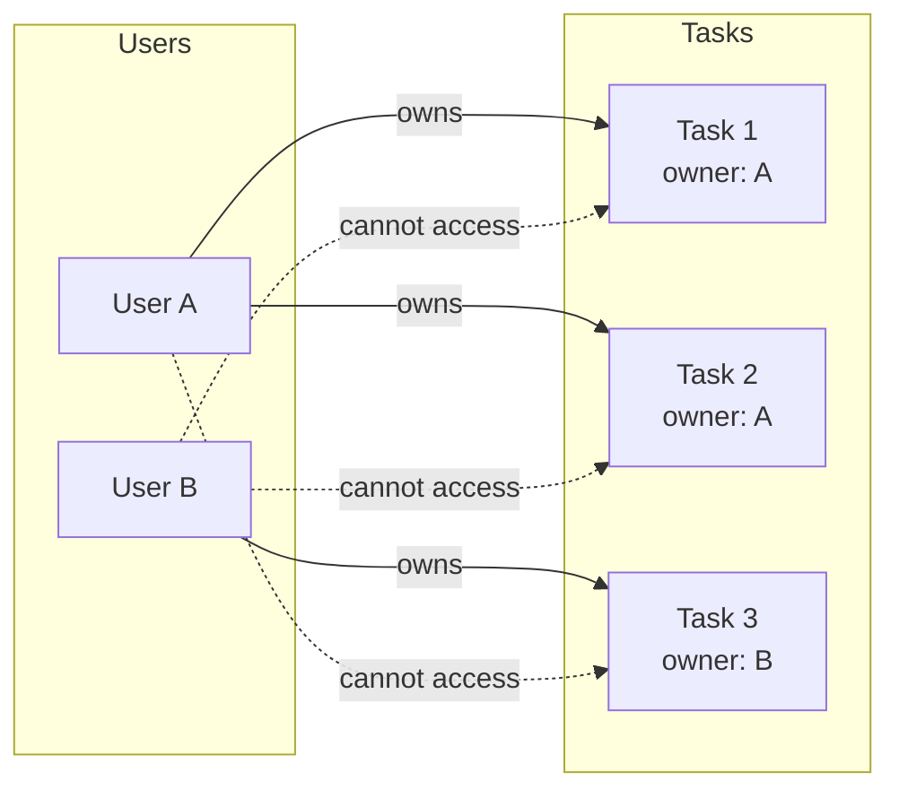
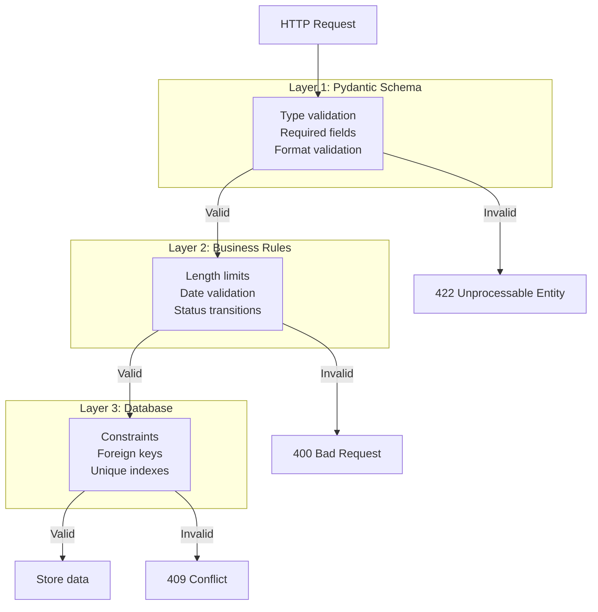
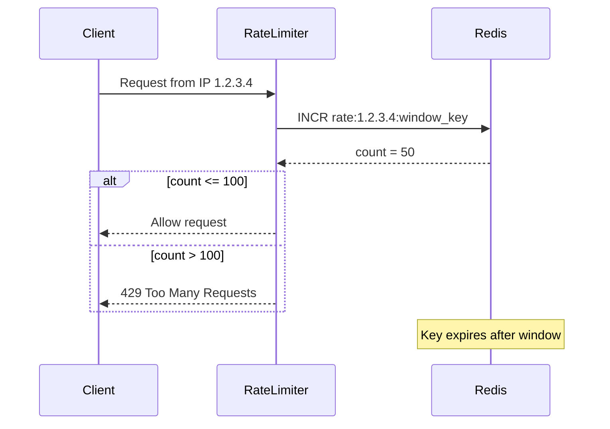
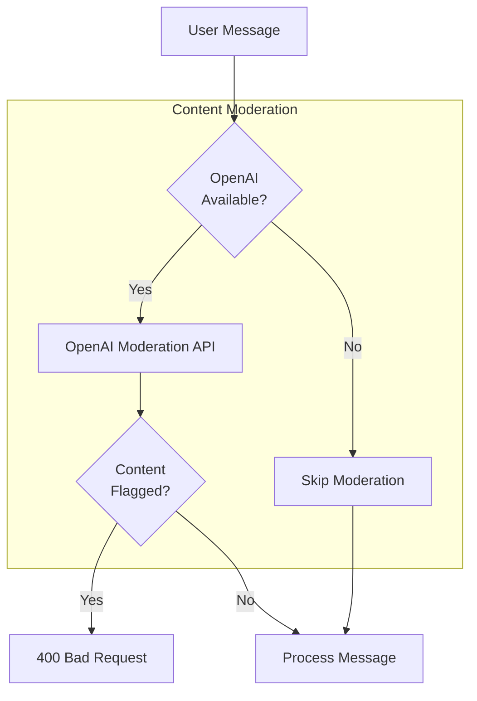

# Security Architecture

This document describes the security architecture, threat model, and security controls implemented in Task Tracker.

## 1. Security Overview



## 2. Authentication Architecture

### 2.1 JWT Token Flow



### 2.2 Token Security Properties

| Property | Access Token | Refresh Token |
|----------|--------------|---------------|
| **Expiry** | 15 minutes | 7 days |
| **Storage** | Memory/localStorage | localStorage + DB hash |
| **Revocable** | No (short-lived) | Yes (DB lookup) |
| **Contains** | user_id, exp, type | user_id, exp, type |
| **Algorithm** | HS256 (HMAC-SHA256) | HS256 (HMAC-SHA256) |

### 2.3 Password Security

```python
# Password hashing with bcrypt
from passlib.context import CryptContext

pwd_context = CryptContext(schemes=["bcrypt"], deprecated="auto")

# Hash on registration
password_hash = pwd_context.hash(plain_password)

# Verify on login
is_valid = pwd_context.verify(plain_password, password_hash)
```

**Properties:**
- Automatic salt generation
- Configurable cost factor (work factor)
- Resistant to rainbow table attacks
- Slow by design (prevents brute force)

## 3. Authorization Model

### 3.1 Resource Ownership



### 3.2 Authorization Checks

```python
# Entity-level authorization (Rich Domain Model)
class Task(BaseModel):
    owner_id: UUID

    def can_be_modified_by(self, user_id: UUID) -> bool:
        return self.owner_id == user_id

    def can_be_viewed_by(self, user_id: UUID) -> bool:
        return self.owner_id == user_id

# Service-level check
async def get_task_by_id(self, task_id: UUID, user_id: UUID) -> Task:
    task = await self.task_repo.get_by_id(task_id)
    if not task:
        raise NotFoundError("Task not found")
    if not task.can_be_viewed_by(user_id):
        raise AuthorizationError("Not authorized")
    return task
```

### 3.3 Protected Endpoints

| Endpoint | Auth Required | Authorization |
|----------|---------------|---------------|
| `POST /auth/register` | No | - |
| `POST /auth/login` | No | - |
| `POST /auth/refresh` | No (token in body) | Valid refresh token |
| `GET /auth/me` | Yes | Own profile only |
| `DELETE /auth/me` | Yes | Own account only |
| `GET /tasks` | Yes | Own tasks only |
| `POST /tasks` | Yes | Creates as owner |
| `GET /tasks/{id}` | Yes | Owner only |
| `PUT /tasks/{id}` | Yes | Owner only |
| `DELETE /tasks/{id}` | Yes | Owner only |
| `POST /tasks/{id}/attachments` | Yes | Task owner only |
| `GET /audit` | Yes | Own events only |
| `POST /chat/messages` | Yes | Creates tasks as owner |

## 4. Input Validation

### 4.1 Validation Layers



### 4.2 Validation Examples

```python
# Pydantic schema validation
class TaskCreate(BaseModel):
    title: str = Field(..., min_length=1, max_length=500)
    description: Optional[str] = Field(None, max_length=5000)
    status: Optional[TaskStatus] = None
    priority: Optional[TaskPriority] = None
    due_date: Optional[datetime] = None
    tags: Optional[List[str]] = Field(default_factory=list, max_items=10)

# Service-level validation
async def create_task(self, ...):
    if not title or not title.strip():
        raise ValueError("Title cannot be empty")

    if due_date and due_date < utc_now():
        raise ValidationError("Due date cannot be in the past")

# SQL injection prevention (parameterized queries)
result = await session.execute(
    select(TaskModel).where(TaskModel.owner_id == owner_id)  # Safe
)
```

## 5. Rate Limiting

### 5.1 Sliding Window Algorithm



### 5.2 Rate Limit Configuration

```python
# Settings
rate_limit_per_minute: int = 100

# Implementation
class RateLimiter:
    async def check_rate_limit(self, client_ip: str) -> bool:
        key = f"rate:{client_ip}:{window_key}"
        count = await self.redis.incr(key)
        if count == 1:
            await self.redis.expire(key, 60)  # 1 minute window
        return count <= self.limit
```

### 5.3 Fail-Open Behavior

If Redis is unavailable, rate limiting is **disabled** (fail-open):

```python
async def check_rate_limit(self, client_ip: str) -> bool:
    try:
        # Check Redis
        ...
    except Exception:
        # Redis down - allow request
        return True
```

## 6. Content Moderation

### 6.1 Moderation Flow



### 6.2 Moderation Categories

OpenAI's moderation API checks for:
- Hate speech
- Violence
- Self-harm
- Sexual content
- Harassment

### 6.3 Fail-Open Design

Content moderation fails open to maintain availability:

```python
async def _run_safety(self, message: str) -> None:
    if self.safety_checker:
        try:
            safety = await self.safety_checker.check(message)
            if safety.flagged:
                raise ValidationError(safety.reason)
        except ValidationError:
            raise  # Re-raise moderation failures
        except Exception:
            pass  # Skip on API errors
```

## 7. Audit Logging

### 7.1 Audit Event Structure

```python
class AuditEvent(BaseModel):
    id: UUID
    user_id: Optional[UUID]  # NULL after user deletion
    event_type: EventType
    task_id: Optional[UUID]  # NULL after task deletion
    details: Dict            # JSONB for flexible data
    created_at: datetime
```

### 7.2 Audited Events

| Event Type | Trigger | Details Captured |
|------------|---------|------------------|
| `USER_REGISTERED` | New account | email |
| `USER_LOGIN` | Successful login | - |
| `USER_DELETED` | Account deletion | - |
| `TASK_CREATED` | New task | title, status, priority |
| `TASK_UPDATED` | Task modified | changes (old/new values) |
| `TASK_DELETED` | Task removed | title, status |
| `ATTACHMENT_UPLOADED` | File upload | filename, size |
| `ATTACHMENT_DELETED` | File removal | filename |

### 7.3 Audit Integrity

- **Immutable**: No UPDATE or DELETE on audit_events
- **Survives deletion**: SET NULL FK preserves events after entity deletion
- **Tamper-evident**: Correlation IDs link requests to events

## 8. Data Protection

### 8.1 Data Classification

| Data Type | Classification | Protection |
|-----------|----------------|------------|
| Passwords | Sensitive | bcrypt hash, never stored plain |
| Tokens | Secret | Hashed in DB, short expiry |
| Email | PII | Encrypted in transit (HTTPS) |
| Task content | Private | Owner-only access |
| Audit logs | System | Immutable, retained |
| Attachments | Private | Owner-only access, local storage |

### 8.2 Data in Transit

All communication uses HTTPS:
- Frontend ↔ Backend: HTTPS
- Backend ↔ OpenAI: HTTPS
- Internal Docker network: Unencrypted (trusted network)

### 8.3 Data at Rest

| Store | Encryption | Notes |
|-------|------------|-------|
| PostgreSQL | Not encrypted | Use disk encryption in production |
| Redis | Not encrypted | Temporary data only |
| File uploads | Not encrypted | Use disk encryption in production |

## 9. Threat Model

### 9.1 STRIDE Analysis

| Threat | Category | Mitigation |
|--------|----------|------------|
| Token theft | Spoofing | Short expiry (15min), HTTPS only |
| Brute force login | Tampering | Rate limiting, bcrypt |
| Data exfiltration | Information Disclosure | Owner-only access, audit logs |
| Token replay | Repudiation | Token revocation, audit trail |
| DDoS | Denial of Service | Rate limiting |
| Privilege escalation | Elevation of Privilege | Owner checks, no admin roles |

### 9.2 Attack Surface

```mermaid
flowchart LR
    subgraph Public["Public Endpoints"]
        Login[/auth/login]
        Register[/auth/register]
        Refresh[/auth/refresh]
    end

    subgraph Protected["Protected Endpoints"]
        Tasks[/tasks/*]
        Chat[/chat/*]
        Audit[/audit]
    end

    subgraph External["External APIs"]
        OpenAI[OpenAI API]
    end

    Attacker((Attacker))

    Attacker -->|Brute force| Login
    Attacker -->|Account spam| Register
    Attacker -->|Token theft| Refresh
    Attacker -->|"Requires valid token"| Protected
```

### 9.3 Security Controls Matrix

| Attack Vector | Prevention | Detection | Response |
|---------------|------------|-----------|----------|
| Credential stuffing | Rate limiting, bcrypt | Audit logs | Account lockout (future) |
| XSS | React auto-escaping | - | - |
| CSRF | SameSite cookies, Bearer tokens | - | - |
| SQL injection | Parameterized queries | Error logs | - |
| API abuse | Rate limiting | Metrics | 429 response |
| Token theft | Short expiry, revocation | Audit logs | Force re-login |

## 10. Security Checklist

### 10.1 Implemented

- [x] Password hashing with bcrypt
- [x] JWT authentication with short expiry
- [x] Refresh token revocation
- [x] Rate limiting (100 req/min)
- [x] Input validation (Pydantic)
- [x] Owner-based authorization
- [x] Audit logging
- [x] CORS configuration
- [x] Content moderation (optional)
- [x] Parameterized SQL queries

### 10.2 Recommended for Production

- [ ] HTTPS termination (TLS 1.3)
- [ ] Database encryption at rest
- [ ] Secret management (Vault, AWS Secrets Manager)
- [ ] Security headers (HSTS, CSP, X-Frame-Options)
- [ ] Account lockout after failed attempts
- [ ] IP-based anomaly detection
- [ ] Regular security audits
- [ ] Dependency vulnerability scanning
- [ ] WAF (Web Application Firewall)

## 11. Incident Response

### 11.1 Security Event Detection

Monitor these signals:
- High rate of 401/403 responses
- Unusual audit event patterns
- Rate limit triggers from single IP
- Token refresh failures
- OpenAI moderation flags

### 11.2 Response Procedures

| Incident | Immediate Action | Follow-up |
|----------|------------------|-----------|
| Suspected breach | Revoke all tokens, rotate JWT secret | Forensic analysis |
| Token leak | Revoke affected user's tokens | Notify user |
| API abuse | Block IP, increase rate limits | Analyze patterns |
| Malicious content | Review audit logs, delete content | Report to OpenAI |
