# Sequence Diagrams

This document contains detailed sequence diagrams for key system interactions.

## 1. User Registration

## 2. User Login with Token Generation

## 3. Authenticated API Request

## 4. Task Creation with Tags

```mermaid
sequenceDiagram
    autonumber
    participant C as Client
    participant A as API Layer
    participant TS as TaskService
    participant TagS as TagService
    participant TagR as TagRepository
    participant TR as TaskRepository
    participant AR as AuditRepository
    participant M as Metrics
    participant DB as PostgreSQL

    C->>A: POST /api/v1/tasks<br/>{title, description, tags: ["work", "urgent"]}

    A->>A: Validate TaskCreate schema

    A->>TS: create_task(owner_id, title, ..., tags)

    Note over TS: Start timer for metrics

    TS->>TS: Validate title not empty
    TS->>TS: Validate title length <= 500

    TS->>TagS: ensure_tags_exist(["work", "urgent"])

    loop For each tag
        TagS->>TagS: normalize(tag) → lowercase, strip
        TagS->>TagR: get_or_create(normalized_tag)
        TagR->>DB: SELECT * FROM tags WHERE name = ?
        alt Tag exists
            DB-->>TagR: TagModel
        else Tag not exists
            TagR->>DB: INSERT INTO tags (name)
            DB-->>TagR: TagModel
        end
        TagR-->>TagS: Tag entity
    end

    TagS-->>TS: [Tag entities]

    TS->>TS: Create Task entity with tag names

    TS->>TR: create(task)
    TR->>DB: INSERT INTO tasks (...)
    TR->>DB: INSERT INTO task_tags (task_id, tag_id)
    DB-->>TR: task_id
    TR-->>TS: Task entity

    TS->>AR: create(AuditEvent TASK_CREATED)
    AR->>DB: INSERT INTO audit_events (...)

    TS->>M: track_task_operation("create", "success", duration)
    TS->>M: increment_task_count(TODO)
    TS->>M: track_audit_event("TASK_CREATED")

    TS-->>A: Task entity

    A-->>C: 201 Created<br/>{id, title, tags: ["work", "urgent"], ...}
```

## 5. Chat Message Processing

## 6. File Upload

## 7. Token Refresh

## 8. Background Reminder Processing

## 9. Account Deletion

## Error Handling Sequence

